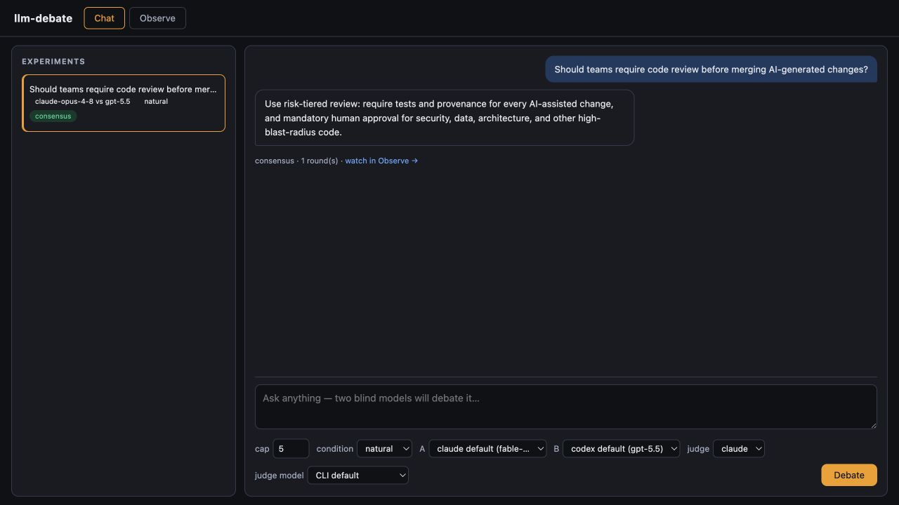
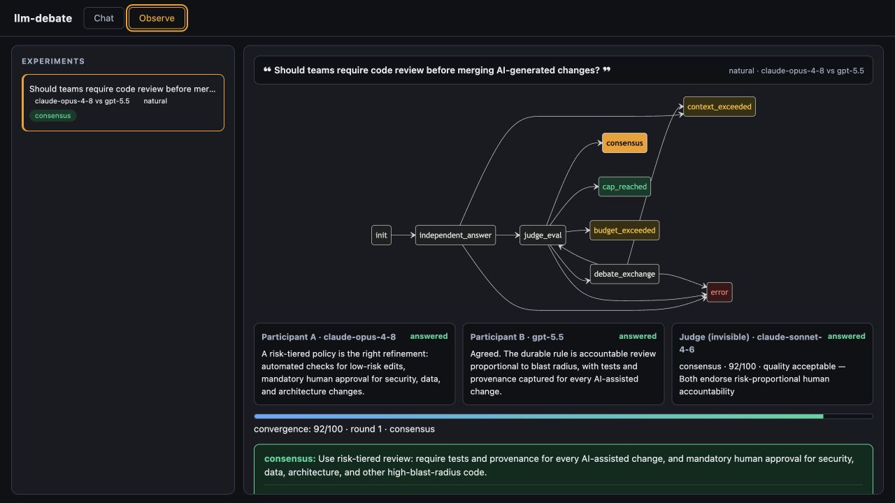

# llm-debate

Run a blind, two-model debate and let a separate judge select the strongest final answer.

`llm-debate` orchestrates the Claude and Codex command-line tools. Each participant answers
independently, sees only anonymized arguments from the other participant, and revises until the
judge accepts the result or the configured limit is reached.

## Chat

Ask a question, choose the debate settings, and receive the judge's best answer.



## Observe

Follow the same run live: state transitions, participant responses, judge decisions, convergence,
and the complete event feed.



The screenshots contain synthetic example data.

## Requirements

- Python 3.12 or newer
- [uv](https://docs.astral.sh/uv/)
- Authenticated `claude` and `codex` commands on your `PATH`

## Start the web app

```bash
git clone https://github.com/Kejixu/llm-debate.git
cd llm-debate
uv sync
uv run llm-debate-ui
```

Open [http://127.0.0.1:8710](http://127.0.0.1:8710). The server listens on localhost by default.

## Run from the terminal

```bash
uv run llm-debate \
  "Should teams require code review before merging AI-generated changes?" \
  --cap 5 \
  --condition natural \
  --max-minutes 30
```

Every run is stored under `runs/<run-id>/` with its configuration, event log, status, transcript,
and isolated CLI working directories. The `runs/` directory is ignored by Git.

## How it works

1. Claude and Codex answer the prompt concurrently.
2. Their responses are sanitized and anonymized.
3. The judge scores convergence and answer quality.
4. The participants exchange another anonymous round when needed.
5. The run ends at consensus, the exchange cap, the time budget, or an explicit error state.

The FastAPI server streams events to the browser with Server-Sent Events. Completed runs use the
same event log for replay, so Chat and Observe show live and historical runs consistently.

## Optional Langfuse export

Set credentials before starting the web app to export completed runs automatically:

```bash
export LANGFUSE_PUBLIC_KEY=pk-lf-...
export LANGFUSE_SECRET_KEY=sk-lf-...
export LANGFUSE_HOST=https://cloud.langfuse.com  # optional
uv run llm-debate-ui
```

Re-export an existing run without repeating the debate:

```bash
uv run llm-debate-export runs/<run-id>
```

## Development

```bash
uv sync
uv run ruff check .
uv run ruff format --check .
uv run ty check
uv run pytest
```
